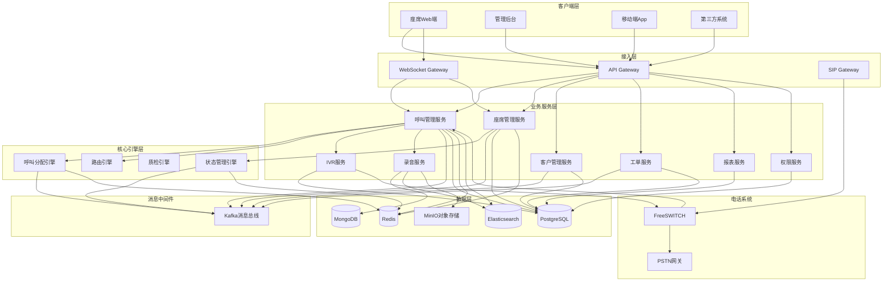
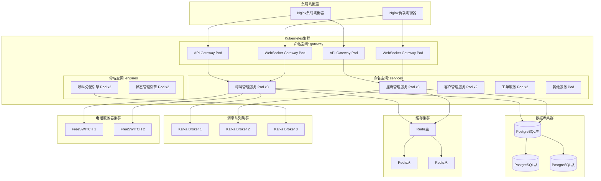
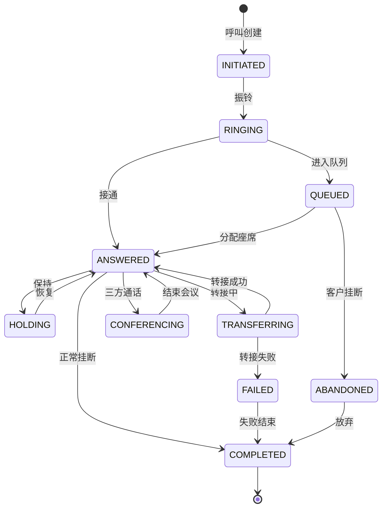
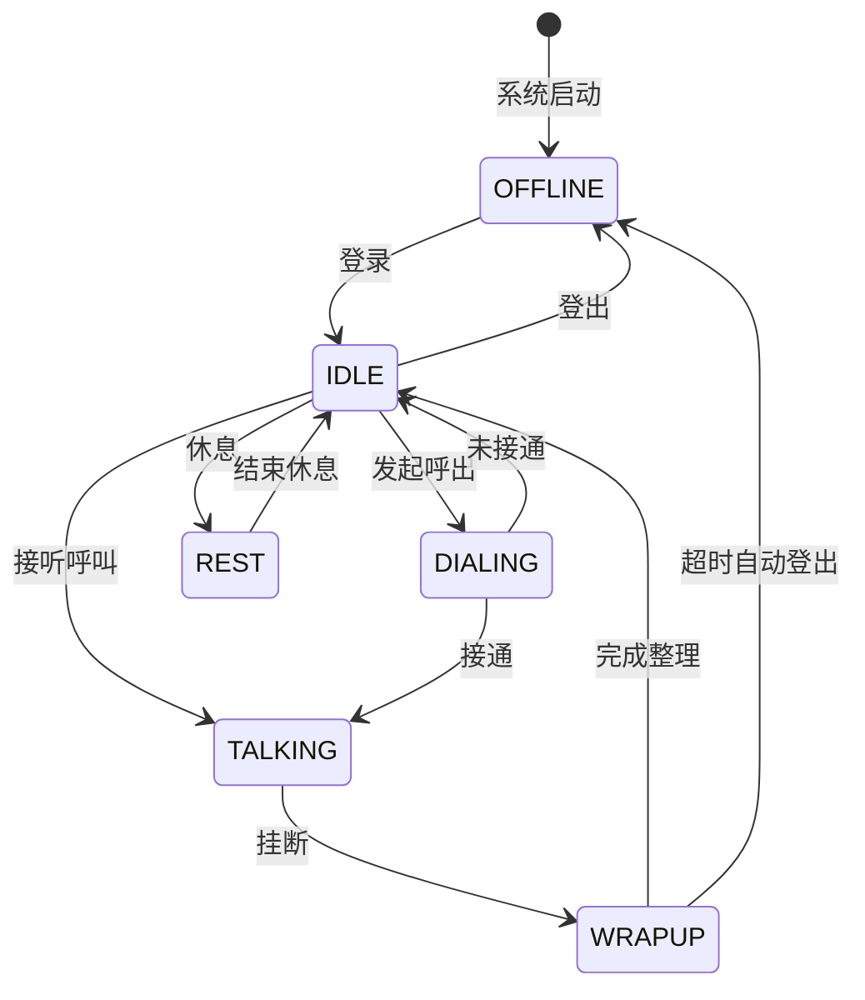
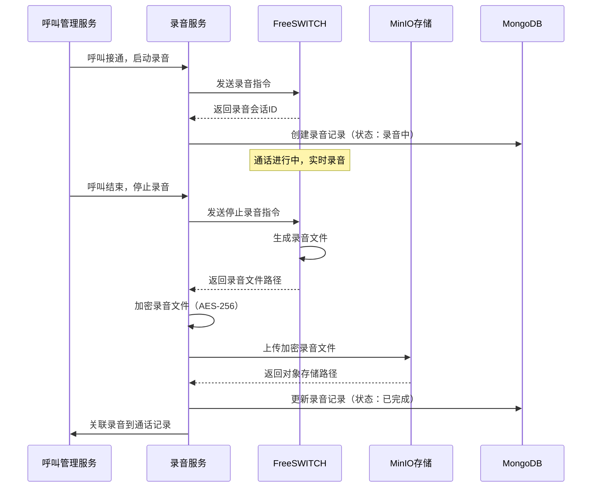
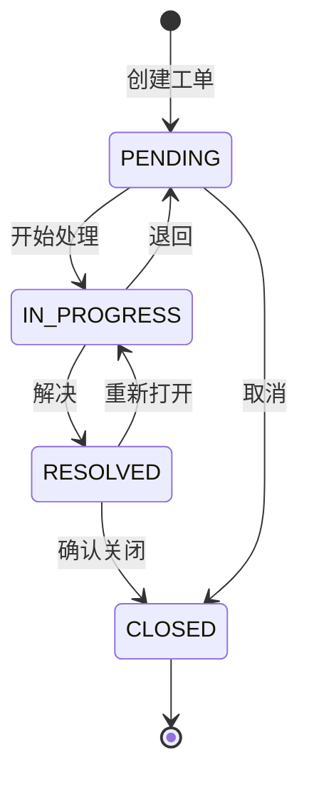

# 技术设计文档 - 千牛云呼叫中心系统

## 概述

千牛云呼叫中心系统是一个企业级的全渠道客户服务平台，采用微服务架构设计，支持高并发、高可用的呼叫处理能力。系统集成了电话网关、IVR语音导航、智能呼叫分配、实时监控、工单管理等核心功能模块，为企业提供完整的客户服务解决方案。

### 设计目标

1. **高可用性**: 系统可用性达到99.9%以上，支持故障自动切换
2. **高并发**: 支持1000+并发呼叫，10000+在线座席
3. **实时性**: 呼叫分配延迟<2秒，状态更新延迟<1秒
4. **可扩展性**: 支持水平扩展，模块化设计便于功能扩展
5. **安全性**: 数据加密传输和存储，完善的权限控制体系
6. **可维护性**: 清晰的模块划分，完善的日志和监控体系

### 技术栈选择

**后端技术栈:**
- **开发语言**: Java 17 (Spring Boot 3.x)
- **微服务框架**: Spring Cloud (Gateway, Config, Discovery)
- **消息队列**: Apache Kafka (事件驱动架构)
- **缓存**: Redis (状态管理、会话缓存)
- **数据库**: PostgreSQL (业务数据) + MongoDB (日志和录音元数据)
- **搜索引擎**: Elasticsearch (通话记录检索)
- **实时通信**: WebSocket (座席端实时推送)
- **任务调度**: Quartz (定时任务和报表生成)

**前端技术栈:**
- **框架**: Vue 3 + TypeScript
- **UI组件库**: Element Plus
- **状态管理**: Pinia
- **实时通信**: Socket.IO Client
- **图表库**: ECharts (监控面板和报表)

**电话集成:**
- **SIP协议**: FreeSWITCH (开源电话交换平台)
- **WebRTC**: 支持浏览器端软电话
- **录音存储**: MinIO (对象存储)

**基础设施:**
- **容器化**: Docker + Kubernetes
- **服务网格**: Istio (流量管理和安全)
- **监控**: Prometheus + Grafana
- **日志**: ELK Stack (Elasticsearch + Logstash + Kibana)
- **链路追踪**: Jaeger

---

## 架构设计

### 系统架构图




### 架构分层说明

#### 1. 客户端层
- **座席Web端**: 座席工作台，处理呼叫、查看客户信息、创建工单
- **管理后台**: 系统配置、监控面板、报表查询、权限管理
- **移动端App**: 移动座席应用，支持移动办公
- **第三方系统**: 通过API接口集成的外部CRM、ERP系统

#### 2. 接入层
- **API Gateway**: 统一API入口，负责路由、认证、限流、熔断
- **WebSocket Gateway**: 实时消息推送网关，维持长连接
- **SIP Gateway**: SIP协议网关，连接电话系统和业务系统

#### 3. 业务服务层
采用微服务架构，每个服务独立部署、独立扩展：
- **呼叫管理服务**: 呼叫生命周期管理、通话记录、呼叫统计
- **座席管理服务**: 座席状态管理、技能组管理、排班管理
- **客户管理服务**: 客户信息CRUD、客户标签、客户画像
- **工单服务**: 工单创建、流转、查询、统计
- **IVR服务**: IVR流程配置、语音播放控制
- **录音服务**: 录音文件管理、加密存储、检索播放
- **报表服务**: 报表生成、数据统计、导出功能
- **权限服务**: 用户认证、角色权限、操作审计

#### 4. 核心引擎层
- **呼叫分配引擎**: 智能呼叫路由和分配算法
- **状态管理引擎**: 座席状态实时同步和管理
- **质检引擎**: 通话质量评估和自动质检
- **路由引擎**: 基于规则的呼叫路由决策

#### 5. 数据层
- **PostgreSQL**: 存储结构化业务数据（客户、座席、工单、配置）
- **MongoDB**: 存储半结构化数据（通话详单、录音元数据、日志）
- **Redis**: 缓存热点数据、座席状态、会话信息
- **Elasticsearch**: 全文检索通话记录、工单、客户信息
- **MinIO**: 对象存储录音文件、报表文件

#### 6. 消息中间件
- **Kafka**: 事件驱动架构的消息总线，解耦服务间通信

#### 7. 电话系统
- **FreeSWITCH**: 开源SIP服务器，处理呼叫信令和媒体流
- **PSTN网关**: 连接公共电话网络

### 部署架构




### 高可用设计

1. **服务冗余**: 所有核心服务至少部署2个实例
2. **数据库主从**: PostgreSQL采用一主多从架构，自动故障切换
3. **缓存集群**: Redis Sentinel模式，支持自动故障转移
4. **消息队列**: Kafka集群部署，副本因子为3
5. **负载均衡**: Nginx双机热备，Keepalived实现VIP漂移
6. **电话服务器**: FreeSWITCH双活部署，DNS轮询负载均衡

---

## 核心组件设计

### 1. 呼叫管理服务 (Call Management Service)

#### 职责
- 管理呼叫生命周期（创建、接通、转接、挂断）
- 记录通话详单和统计数据
- 协调IVR服务和录音服务
- 发布呼叫事件到消息总线

#### 核心接口

```java
public interface CallManagementService {
    /**
     * 创建呼入呼叫
     */
    CallSession createInboundCall(String callerId, String calledNumber);
    
    /**
     * 创建呼出呼叫
     */
    CallSession createOutboundCall(Long agentId, String customerPhone);
    
    /**
     * 接通呼叫
     */
    void answerCall(String callId, Long agentId);
    
    /**
     * 转接呼叫
     */
    void transferCall(String callId, Long targetAgentId);
    
    /**
     * 发起三方通话
     */
    void conferenceCall(String callId, Long thirdPartyId);
    
    /**
     * 挂断呼叫
     */
    void hangupCall(String callId, HangupReason reason);
    
    /**
     * 查询通话记录
     */
    Page<CallRecord> queryCallRecords(CallRecordQuery query);
}
```

#### 呼叫状态机




#### 事件发布

呼叫管理服务在状态变更时发布事件到Kafka：

```java
public class CallEvent {
    private String callId;
    private CallEventType eventType; // CREATED, ANSWERED, TRANSFERRED, COMPLETED
    private Long agentId;
    private String customerId;
    private LocalDateTime timestamp;
    private Map<String, Object> metadata;
}
```

### 2. 呼叫分配引擎 (Call Distribution Engine)

#### 职责
- 根据路由规则分配呼叫给合适的座席
- 支持多种分配策略（轮询、最长空闲、技能匹配、VIP优先）
- 管理呼叫队列
- 实时监控队列状态

#### 分配算法

**技能匹配 + 最长空闲算法**:

```java
public class CallDistributionEngine {
    
    /**
     * 分配呼叫给座席
     */
    public Agent distributeCall(Call call) {
        // 1. 根据呼叫类型确定技能组
        SkillGroup skillGroup = routingEngine.determineSkillGroup(call);
        
        // 2. 获取该技能组的空闲座席列表
        List<Agent> availableAgents = agentService.getAvailableAgents(skillGroup);
        
        if (availableAgents.isEmpty()) {
            // 3. 无空闲座席，加入队列
            callQueueService.enqueue(call, skillGroup);
            return null;
        }
        
        // 4. VIP客户优先分配给高级座席
        if (call.isVipCustomer()) {
            availableAgents = filterSeniorAgents(availableAgents);
        }
        
        // 5. 选择空闲时间最长的座席
        Agent selectedAgent = availableAgents.stream()
            .max(Comparator.comparing(Agent::getIdleDuration))
            .orElse(null);
        
        // 6. 分配呼叫
        if (selectedAgent != null) {
            assignCallToAgent(call, selectedAgent);
        }
        
        return selectedAgent;
    }
}
```

#### 队列管理

```java
public class CallQueueService {
    
    /**
     * 呼叫入队
     */
    public void enqueue(Call call, SkillGroup skillGroup) {
        String queueKey = "call:queue:" + skillGroup.getId();
        
        // 使用Redis有序集合，按时间戳排序
        redisTemplate.opsForZSet().add(
            queueKey, 
            call.getId(), 
            System.currentTimeMillis()
        );
        
        // 发布队列变更事件
        publishQueueEvent(skillGroup, QueueEventType.ENQUEUED);
        
        // 启动超时检查
        scheduleTimeoutCheck(call);
    }
    
    /**
     * 呼叫出队
     */
    public Call dequeue(SkillGroup skillGroup) {
        String queueKey = "call:queue:" + skillGroup.getId();
        
        // 获取队列中等待时间最长的呼叫
        Set<String> callIds = redisTemplate.opsForZSet()
            .range(queueKey, 0, 0);
        
        if (callIds.isEmpty()) {
            return null;
        }
        
        String callId = callIds.iterator().next();
        redisTemplate.opsForZSet().remove(queueKey, callId);
        
        return callService.getCall(callId);
    }
}
```

### 3. 座席管理服务 (Agent Management Service)

#### 职责
- 管理座席信息和技能组
- 维护座席实时状态
- 处理座席登录登出
- 统计座席工作量

#### 座席状态管理




#### 状态同步机制

座席状态变更通过Redis Pub/Sub实时广播：

```java
public class AgentStatusManager {
    
    /**
     * 更新座席状态
     */
    public void updateAgentStatus(Long agentId, AgentStatus newStatus) {
        Agent agent = agentRepository.findById(agentId)
            .orElseThrow(() -> new AgentNotFoundException(agentId));
        
        AgentStatus oldStatus = agent.getStatus();
        agent.setStatus(newStatus);
        agent.setStatusChangeTime(LocalDateTime.now());
        
        // 1. 更新数据库
        agentRepository.save(agent);
        
        // 2. 更新Redis缓存
        String cacheKey = "agent:status:" + agentId;
        redisTemplate.opsForValue().set(cacheKey, newStatus, 1, TimeUnit.HOURS);
        
        // 3. 发布状态变更事件
        AgentStatusEvent event = new AgentStatusEvent(
            agentId, oldStatus, newStatus, LocalDateTime.now()
        );
        kafkaTemplate.send("agent-status-events", event);
        
        // 4. 通过WebSocket推送给监控面板
        webSocketService.broadcast("/topic/agent-status", event);
        
        // 5. 如果变为空闲，触发呼叫分配
        if (newStatus == AgentStatus.IDLE) {
            callDistributionEngine.tryAssignQueuedCalls(agent);
        }
    }
}
```

### 4. IVR服务 (IVR Service)

#### 职责
- 管理IVR流程配置
- 控制语音播放和按键识别
- 处理自助服务逻辑
- 路由到人工服务

#### IVR流程配置

IVR流程采用JSON配置，支持可视化编辑：

```json
{
  "ivrId": "main-menu",
  "name": "主菜单",
  "nodes": [
    {
      "nodeId": "welcome",
      "type": "PLAY_AUDIO",
      "audioFile": "welcome.wav",
      "nextNode": "main-menu"
    },
    {
      "nodeId": "main-menu",
      "type": "GET_DIGITS",
      "prompt": "请按1咨询业务，按2投诉建议，按0转人工",
      "timeout": 10,
      "maxDigits": 1,
      "routes": [
        {"digit": "1", "nextNode": "business-menu"},
        {"digit": "2", "nextNode": "complaint-menu"},
        {"digit": "0", "nextNode": "transfer-agent"},
        {"timeout": true, "nextNode": "repeat-menu"}
      ]
    },
    {
      "nodeId": "transfer-agent",
      "type": "TRANSFER",
      "skillGroup": "general",
      "maxWaitTime": 300
    }
  ]
}
```

#### IVR执行引擎

```java
public class IVRExecutionEngine {
    
    /**
     * 执行IVR流程
     */
    public void executeIVR(String callId, String ivrId) {
        IVRFlow flow = ivrConfigService.getIVRFlow(ivrId);
        IVRSession session = new IVRSession(callId, flow);
        
        // 从第一个节点开始执行
        executeNode(session, flow.getStartNode());
    }
    
    private void executeNode(IVRSession session, IVRNode node) {
        switch (node.getType()) {
            case PLAY_AUDIO:
                freeSwitchClient.playAudio(session.getCallId(), node.getAudioFile());
                // 播放完成后执行下一个节点
                scheduleNextNode(session, node.getNextNode());
                break;
                
            case GET_DIGITS:
                freeSwitchClient.collectDigits(
                    session.getCallId(),
                    node.getMaxDigits(),
                    node.getTimeout(),
                    digit -> handleDigitInput(session, node, digit)
                );
                break;
                
            case TRANSFER:
                Call call = callService.getCall(session.getCallId());
                call.setSkillGroup(node.getSkillGroup());
                callDistributionEngine.distributeCall(call);
                break;
                
            case QUERY_INFO:
                // 执行自助查询逻辑
                String result = executeQuery(session, node.getQueryType());
                freeSwitchClient.playTTS(session.getCallId(), result);
                break;
        }
    }
}
```

### 5. 录音服务 (Recording Service)

#### 职责
- 控制录音启停
- 录音文件存储和加密
- 录音检索和播放
- 录音文件生命周期管理

#### 录音流程




#### 录音加密

```java
public class RecordingEncryptionService {
    
    @Value("${recording.encryption.key}")
    private String encryptionKey;
    
    /**
     * 加密录音文件
     */
    public File encryptRecording(File originalFile) throws Exception {
        SecretKeySpec secretKey = new SecretKeySpec(
            encryptionKey.getBytes(), "AES"
        );
        
        Cipher cipher = Cipher.getInstance("AES/CBC/PKCS5Padding");
        cipher.init(Cipher.ENCRYPT_MODE, secretKey);
        
        try (FileInputStream fis = new FileInputStream(originalFile);
             FileOutputStream fos = new FileOutputStream(originalFile.getPath() + ".enc");
             CipherOutputStream cos = new CipherOutputStream(fos, cipher)) {
            
            byte[] buffer = new byte[8192];
            int bytesRead;
            while ((bytesRead = fis.read(buffer)) != -1) {
                cos.write(buffer, 0, bytesRead);
            }
        }
        
        File encryptedFile = new File(originalFile.getPath() + ".enc");
        originalFile.delete(); // 删除原始文件
        
        return encryptedFile;
    }
    
    /**
     * 解密录音文件（用于播放）
     */
    public InputStream decryptRecording(InputStream encryptedStream) throws Exception {
        SecretKeySpec secretKey = new SecretKeySpec(
            encryptionKey.getBytes(), "AES"
        );
        
        Cipher cipher = Cipher.getInstance("AES/CBC/PKCS5Padding");
        cipher.init(Cipher.DECRYPT_MODE, secretKey);
        
        return new CipherInputStream(encryptedStream, cipher);
    }
}
```

### 6. 工单服务 (Ticket Service)

#### 职责
- 工单创建和流转
- 工单分配和处理
- 工单查询和统计
- 工单提醒和通知

#### 工单状态流转




#### 工单自动分配

```java
public class TicketAssignmentService {
    
    /**
     * 自动分配工单
     */
    public void autoAssignTicket(Ticket ticket) {
        // 1. 根据工单类型确定处理技能组
        SkillGroup skillGroup = determineSkillGroup(ticket.getCategory());
        
        // 2. 获取该技能组的在线座席
        List<Agent> availableAgents = agentService
            .getOnlineAgents(skillGroup);
        
        if (availableAgents.isEmpty()) {
            // 无可用座席，工单保持待分配状态
            return;
        }
        
        // 3. 根据工单优先级选择座席
        Agent assignee;
        if (ticket.getPriority() == Priority.URGENT) {
            // 紧急工单分配给高级座席
            assignee = availableAgents.stream()
                .filter(Agent::isSenior)
                .min(Comparator.comparing(Agent::getPendingTicketCount))
                .orElse(availableAgents.get(0));
        } else {
            // 普通工单负载均衡分配
            assignee = availableAgents.stream()
                .min(Comparator.comparing(Agent::getPendingTicketCount))
                .orElse(null);
        }
        
        // 4. 分配工单
        ticket.setAssignee(assignee);
        ticket.setStatus(TicketStatus.IN_PROGRESS);
        ticketRepository.save(ticket);
        
        // 5. 发送通知
        notificationService.notifyAgentNewTicket(assignee, ticket);
    }
}
```

### 7. 报表服务 (Report Service)

#### 职责
- 生成各类统计报表
- 数据聚合和计算
- 报表导出（PDF、Excel）
- 定时报表自动生成

#### 报表类型

1. **座席绩效报表**: 接听量、通话时长、平均处理时长、满意度
2. **呼叫统计报表**: 呼入量、呼出量、接通率、放弃率、平均等待时长
3. **客户满意度报表**: 评分分布、平均分、趋势分析
4. **工单统计报表**: 创建量、解决量、平均处理时长、超时工单
5. **队列统计报表**: 队列长度、等待时长、溢出率

#### 报表生成流程

```java
@Service
public class ReportGenerationService {
    
    /**
     * 生成座席绩效报表
     */
    public Report generateAgentPerformanceReport(
        LocalDate startDate, 
        LocalDate endDate,
        List<Long> agentIds
    ) {
        // 1. 从数据库聚合统计数据
        List<AgentPerformanceData> data = callRecordRepository
            .aggregateAgentPerformance(startDate, endDate, agentIds);
        
        // 2. 计算衍生指标
        data.forEach(d -> {
            d.setAvgHandleTime(d.getTotalTalkTime() / d.getCallCount());
            d.setUtilizationRate(
                d.getTotalTalkTime() / d.getTotalOnlineTime()
            );
        });
        
        // 3. 生成报表对象
        Report report = new Report();
        report.setType(ReportType.AGENT_PERFORMANCE);
        report.setStartDate(startDate);
        report.setEndDate(endDate);
        report.setData(data);
        report.setGeneratedAt(LocalDateTime.now());
        
        // 4. 保存报表
        reportRepository.save(report);
        
        return report;
    }
    
    /**
     * 导出报表为Excel
     */
    public byte[] exportToExcel(Report report) {
        try (Workbook workbook = new XSSFWorkbook()) {
            Sheet sheet = workbook.createSheet("报表数据");
            
            // 创建表头
            Row headerRow = sheet.createRow(0);
            String[] headers = getHeaders(report.getType());
            for (int i = 0; i < headers.length; i++) {
                headerRow.createCell(i).setCellValue(headers[i]);
            }
            
            // 填充数据
            List<Map<String, Object>> data = report.getData();
            for (int i = 0; i < data.size(); i++) {
                Row row = sheet.createRow(i + 1);
                fillRowData(row, data.get(i), report.getType());
            }
            
            // 输出为字节数组
            ByteArrayOutputStream baos = new ByteArrayOutputStream();
            workbook.write(baos);
            return baos.toByteArray();
            
        } catch (IOException e) {
            throw new ReportExportException("导出Excel失败", e);
        }
    }
}
```

---

## 数据模型设计

### 核心实体关系图

