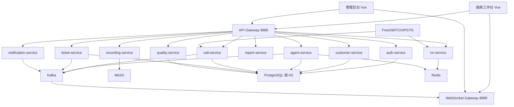

# 千牛云呼叫中心产品解决方案

**适用对象：** 企业负责人、项目经理、客服主管、交付实施人员  
**版本：** 1.0.0  
**最后更新：** 2026-05-11

---

## 1. 产品定位

千牛云呼叫中心是一套面向企业客服、售后、投诉处理、电话营销和内部服务台的呼叫中心平台。系统以“客户来电自动分配、座席统一处理、主管实时监控、服务全过程留痕”为核心，帮助企业把分散的电话服务变成可管理、可统计、可追踪的标准流程。

系统适合以下场景：

| 场景 | 适用说明 |
|------|----------|
| 客服热线 | 客户打进电话后，按技能组、座席状态、客户等级自动分配 |
| 售后服务 | 通话、客户资料、工单、录音形成完整服务记录 |
| 投诉处理 | 投诉电话进入专门技能组，工单跟踪到关闭 |
| 电话回访 | 座席从工作台主动拨打客户电话并填写结果 |
| 主管监控 | 管理员或主管查看在线座席、通话中人数、队列等待和接通率 |
| 质检培训 | 录音留存后用于服务质量检查和座席培训 |

---

## 2. 要解决的问题

很多企业在客服管理中会遇到这些问题：

| 业务问题 | 解决方案 |
|----------|----------|
| 客户电话没人接或分配不均 | 通过技能组和空闲座席算法自动分配 |
| 座席工作状态不可见 | 用座席状态和实时监控大屏展示团队状态 |
| 客户问题反复沟通 | 用客户档案、通话记录、工单记录沉淀上下文 |
| 投诉和复杂问题容易丢失 | 用工单状态流转和超时提醒跟踪闭环 |
| 服务质量难评估 | 用录音、质检评分、满意度和报表分析服务质量 |
| 系统难对接现有 CRM | 提供统一 REST API 和事件消息，可接入第三方系统 |

---

## 3. 角色与职责

| 角色 | 主要工作 |
|------|----------|
| 管理员 | 配置账号、权限、技能组、IVR、系统参数和集成配置 |
| 座席主管 | 查看团队实时状态、处理预警、分配工单、跟进绩效 |
| 座席 | 接听来电、主动呼出、转接、保持、三方通话、填写小结和工单 |
| 质检员 | 查看录音，提交质检评分和改进建议 |
| 运维人员 | 部署服务、监控中间件、排查网关、Kafka、数据库和存储问题 |

---

## 4. 功能模块方案

### 4.1 座席工作台

座席工作台是客服人员每天使用的页面，核心能力包括：

| 功能 | 说明 |
|------|------|
| 软电话 | 支持外呼、接听来电、挂断、保持、恢复、转接、三方通话 |
| 来电弹屏 | 来电时展示客户姓名、号码、VIP 标识等信息 |
| 空闲座席列表 | 转接时快速选择当前可用座席 |
| 实时消息 | 通过 WebSocket 接收来电、工单分配、整理超时等提醒 |
| 降级体验 | 后端未启动时，工作台保留本地演示数据，避免页面空白 |

### 4.2 管理后台

管理后台面向主管和管理员，当前重点提供实时监控能力：

| 功能 | 说明 |
|------|------|
| 实时指标 | 在线座席、通话中、空闲座席、队列等待 |
| 今日统计 | 今日呼入、今日呼出、接通率、平均等待时长 |
| 座席状态表 | 展示座席工号、姓名、技能组、状态、状态时长 |
| 趋势图 | 展示今日呼入和呼出趋势 |
| 状态分布图 | 展示通话中、空闲、整理、休息的占比 |
| 大屏模式 | 适合客服中心监控屏幕展示 |

### 4.3 认证与权限

| 功能 | 说明 |
|------|------|
| 登录认证 | 使用用户名和密码登录，成功后返回 JWT |
| 网关鉴权 | 业务接口经过 API Gateway 校验 Token |
| 用户头透传 | 网关把用户 ID、用户名、角色传给后端服务 |
| 默认管理员 | 初始账号为 `admin`，初始密码为 `Admin@2025` |
| 安全建议 | 生产环境必须修改默认密码和 JWT 密钥 |

### 4.4 呼叫管理

| 功能 | 说明 |
|------|------|
| 呼入建档 | FreeSWITCH 事件触发后创建呼入记录 |
| 主动呼出 | 座席输入号码后创建外呼记录并调用电话网关 |
| 通话控制 | 接听、挂断、保持、恢复、转接、三方通话 |
| 通话小结 | 通话结束后补充处理摘要 |
| 满意度 | 支持 1 到 5 分满意度记录 |
| 录音关联 | 通话记录可关联录音文件和播放地址 |

### 4.5 客户管理

| 功能 | 说明 |
|------|------|
| 客户列表 | 按关键字和 VIP 等级查询客户 |
| 电话查客户 | 来电弹屏可按电话号码查客户 |
| 新增客户 | 保存客户姓名、电话、邮箱、地址、VIP 等级和备注 |
| 更新客户 | 修改客户资料 |
| 黑名单 | 添加、移除和查询黑名单号码 |

### 4.6 座席管理

| 功能 | 说明 |
|------|------|
| 座席列表 | 查询座席资料和当前状态 |
| 状态切换 | 空闲、通话中、整理、休息、离线等状态流转 |
| 登录登出 | 座席登录切为空闲，登出切为离线 |
| 培训模式 | 培训模式下不参与真实来电分配 |
| 技能组 | 提供通用客服、技术支持、投诉处理、VIP 专席等基础技能组 |

### 4.7 工单管理

| 功能 | 说明 |
|------|------|
| 创建工单 | 通话中或通话后创建客户问题工单 |
| 查询工单 | 按状态、优先级、处理人、客户查询 |
| 状态流转 | 待处理、处理中、已解决、已关闭 |
| 分配工单 | 将工单指派给处理人 |
| 超时提醒 | 待处理超过设定时间后发送通知事件 |

### 4.8 IVR 语音导航

| 功能 | 说明 |
|------|------|
| 默认流程 | 提供一个基础默认 IVR 流程 |
| 按键路由 | 1 转通用客服，2 转技术支持，3 转投诉处理 |
| 超时处理 | 多次未按键后转通用客服 |
| 生产接入 | 实际语音播放、按键收集和转人工需要接入 FreeSWITCH 事件 |

### 4.9 录音与质检

| 模块 | 说明 |
|------|------|
| 录音服务 | 处理录音文件加密、上传 MinIO、查询和播放流 |
| 录音保留 | 支持按保留天数清理过期录音元数据 |
| 质检模板 | 创建和查询评分模板 |
| 质检评分 | 对通话提交评分、备注和改进建议 |
| 不合格通知 | 低于通过分数时发送主管通知事件 |

### 4.10 通知与实时推送

| 功能 | 说明 |
|------|------|
| WebSocket 网关 | 前端连接 `/ws/agent` 获取实时事件 |
| 呼叫事件 | 将呼叫事件推送到对应座席 |
| 座席状态事件 | 向管理员和主管广播状态变化 |
| 工单通知 | 工单分配后推送给处理人 |
| 邮件通知 | 支持邮件发送入口 |

---

## 5. 系统架构

---

## 6. 部署方案

### 6.1 开发和演示环境

适合研发、测试、演示使用。

| 组件 | 建议 |
|------|------|
| 数据库 | H2 或 PostgreSQL |
| 注册中心 | Nacos |
| 消息队列 | Kafka |
| 缓存 | Redis |
| 对象存储 | MinIO |
| 前端 | Vite 本地开发服务 |
| 后端 | Maven 启动各 Spring Boot 服务 |

### 6.2 生产环境

适合真实客服中心上线。

| 层级 | 建议 |
|------|------|
| 接入层 | Nginx + API Gateway + WebSocket Gateway |
| 服务层 | 每个微服务至少 2 个副本 |
| 数据层 | PostgreSQL 主从或高可用集群 |
| 消息层 | Kafka 3 节点以上 |
| 缓存层 | Redis 主从或集群 |
| 存储层 | MinIO 分布式或企业对象存储 |
| 电话层 | FreeSWITCH 双机或多节点 |
| 监控层 | Prometheus、Grafana、日志采集和告警 |

---

## 7. 当前版本完整性说明

本项目已完成一轮页面、路由、网关和接口链路检查，并修复了以下会影响使用的问题：

| 类别 | 修复结果 |
|------|----------|
| 前端入口 | 座席工作台和管理后台已接入 Vue Router，避免空白页 |
| 座席工作台 | 软电话、来电弹屏、外呼状态、通话计时、错误提示已补齐 |
| 管理后台 | 实时监控大屏刷新、图表更新和 resize 已补齐 |
| WebSocket | 前端改为原生 WebSocket，后端可消费呼叫、状态、通知事件 |
| 网关鉴权 | 登录公开，退出和修改密码走鉴权路由 |
| 默认账号 | 管理员初始密码由应用启动时加密写入，避免明文或占位 hash |
| 基础控制器 | 客户、座席、工单、IVR、录音、质检、通知已补最小 REST 入口 |
| 服务发现 | 网关和服务增加 Nacos 发现配置 |

需要继续接入或深化的生产能力：

| 能力 | 当前状态 | 生产上线要求 |
|------|----------|--------------|
| FreeSWITCH 真实通话 | 已有服务桩和调用入口 | 需要接入 ESL/SIP 事件、真实线路和录音路径 |
| IVR 可视化配置 | 当前提供默认流程 | 需要数据库配置、语音文件管理和流程编辑器 |
| 报表聚合 | 当前管理后台使用实时接口和降级数据 | 需要从呼叫、座席、工单数据聚合生成真实报表 |
| 前端业务页 | 当前有座席工作台和实时监控大屏 | 客户、工单、质检、录音等管理页面需继续扩展 |
| 权限细分 | 当前有 JWT 和角色透传 | 需要菜单权限、按钮权限和数据范围控制 |
| 生产安全 | 当前提供默认配置 | 需要更换密钥、密码、CORS、HTTPS、审计日志 |

---

## 8. 实施路线

### 第一阶段：基础可演示

| 任务 | 目标 |
|------|------|
| 启动基础设施 | Nacos、Redis、Kafka、数据库、MinIO 可用 |
| 启动核心服务 | 网关、认证、呼叫、座席、客户、工单、报表等可注册 |
| 打开前端页面 | 座席工作台和管理后台正常显示 |
| 演示外呼流程 | 座席输入号码，创建呼叫记录并进入控制面板 |
| 演示监控大屏 | 管理后台展示指标、趋势和座席状态 |

### 第二阶段：业务闭环

| 任务 | 目标 |
|------|------|
| 接入真实座席账号 | 管理用户、角色、座席资料和技能组 |
| 接入客户资料 | 来电号码匹配客户并弹屏 |
| 接入工单页面 | 通话后创建、分配、处理和关闭工单 |
| 接入通知 | 工单和超时提醒实时推送 |
| 接入报表 | 从真实数据计算接通率、等待时长、处理时长 |

### 第三阶段：生产通话

| 任务 | 目标 |
|------|------|
| 接入 FreeSWITCH | 真实呼入、呼出、保持、转接、会议 |
| 接入 IVR | 客户按键进入对应技能组 |
| 接入录音 | 录音加密、上传、播放、保留策略 |
| 接入质检 | 录音评分、质检报表和改进建议 |
| 完成安全加固 | HTTPS、密钥替换、权限控制、审计、备份 |

---

## 9. 验收清单

| 验收项 | 通过标准 |
|--------|----------|
| 页面入口 | 座席工作台和管理后台打开无空白页 |
| 登录认证 | 登录成功返回 Token，业务接口无 Token 会被拦截 |
| 外呼流程 | 创建外呼记录，页面进入呼叫中状态，可挂断 |
| 来电事件 | WebSocket 收到来电事件后弹出来电窗口 |
| 状态更新 | 座席状态变化可写入数据库、Redis 并广播事件 |
| 监控刷新 | 管理后台每 5 秒刷新一次指标和图表 |
| 工单流程 | 工单可创建、查询、分配、变更状态 |
| 客户资料 | 客户可新增、查询、修改，黑名单可添加和移除 |
| 录音接口 | 有录音记录时可查询元数据和播放流 |
| 质检接口 | 可创建模板并提交质检评分 |
| 文档交付 | 产品方案、小白手册、部署和 API 文档齐全 |

---

## 10. 上线前注意事项

1. 必须修改默认管理员密码。
2. 必须修改 `JWT_SECRET`、数据库密码、MinIO 密钥和邮件授权码。
3. 生产环境不要使用 H2，应使用 PostgreSQL 或企业数据库。
4. 需要确认电话线路、SIP 中继、FreeSWITCH 节点和录音目录。
5. 需要为 WebSocket、API Gateway 配置 HTTPS 和可信域名。
6. 需要配置数据库备份、录音备份、日志留存和故障恢复流程。
7. 需要完成真实呼入、呼出、转接、保持、三方、录音、IVR 的端到端测试。
